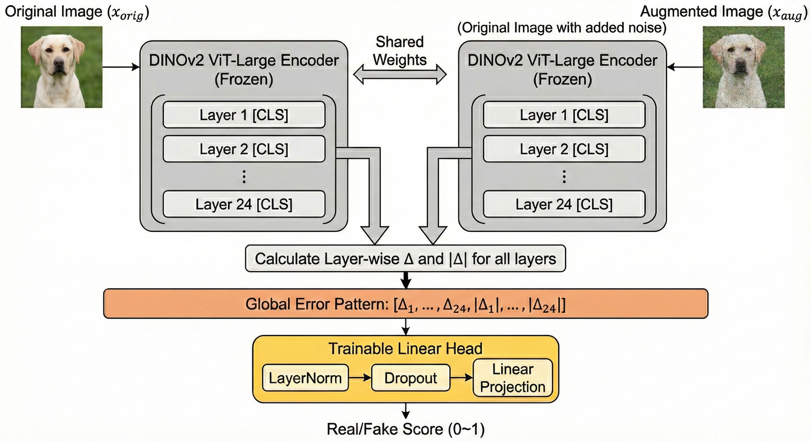

# vision-model-lab (산학협력프로젝트 2025-2) 🚀


> 본 레포지토리는 생성형 AI 탐지 기술의 체계적 검증과 성능 향상을 위한 모듈형 연구 프레임워크입니다. Aeroblade, RIGID와 같은 최신 Training-free 알고리즘을 표준화된 파이프라인으로 통합하여 실험의 효율성을 극대화했으며, 이를 기반으로 DINOv2의 모든 레이어에서 발생하는 미세 에러 패턴을 분석하는 독창적인 **'Ours'** 탐지 모델을 구현했습니다. 단순한 모델 구현을 넘어, 산학협력 프로젝트로서 실제 산업 현장에서 요구되는 다양한 생성 모델에 대한 일반화 성능과 모듈식 설계를 통해 실험의 확장성을 크게 고려했습니다.

## **Ours 모델** — LayerWiseErrorDetector (핵심)

핵심 아이디어: 동일한 DINOv2 백본에 원본/변형 이미지를 통과시켜 각 레이어의 CLS 토큰을 추출하고, 레이어별 차이(delta)와 절대값(abs(delta))을 이어붙여 선형 분류기로 Few-shot(몇 백장-몇 천장 수준의 데이터) 학습하는 방식입니다.<br><br>
기존 방식이 마지막 레이어의 특징(Global semantic)에만 의존하는 것과 달리, 본 모델은 얕은 층부터 깊은 층까지의 에러 반응을 모두 포착하여 탐지 성능을 극대화했습니다.

- 구현 파일: [AIGI_ours/methods/layerwise.py](AIGI_ours/methods/layerwise.py)
- 클래스: `LayerWiseErrorDetector`

<p align="center">
  
</p>

주요 동작 요약:

- 백본: `torch.hub.load('facebookresearch/dinov2', model_id)`로 DINOv2 모델 로드 후 `eval()`로 고정합니다.
- 특징: 각 블록의 `cls_token`만 뽑아 `(B, embed_dim * num_layers)` 형태로 결합합니다.
- 에러 패턴: `delta = z_orig - z_aug` → `error_pattern = concat([delta, abs(delta)])` (옵션)
- 헤드: `LayerNorm` → `Dropout(0.5)` → `Linear(input_dim, 1)` → 로짓
- 추론: `get_score()`는 `sigmoid(logit)`을 반환합니다.

간단 사용 예제 (파이썬):

```python
from AIGI_ours.methods.layerwise import LayerWiseErrorDetector
import torch

detector = LayerWiseErrorDetector(model_id='dinov2_vitb14', device='cuda', use_abs=True)
detector.eval()

# x_orig, x_aug: torch.Tensor (B,3,H,W)
# 예: score = detector.get_score(x_orig, x_aug)
```

설계 의의:

- RIGID처럼 백본 특성을 이용하지만, 레이어 전반의 정보를 학습 가능한 헤드로 통합해 더 풍부한 패턴을 포착합니다.
- 백본을 고정하면 Few-shot 환경에서 빠르게 적응하고 과적합을 줄일 수 있습니다.

<br><br>

# 프로젝트 전체 요약

1. `main.py`: 기본 컴퓨터 비전 딥러닝 **Method** 와 **Model** 실험 프레임워크입니다.
2. `AIGI/`: 최신 **Training-Free** 방법론들(Aeroblade-RAE, Aeroblade-VAE, RIGID 등)을 직접 구현해 비교하는 실험 프레임워크입니다.
3. `AIGI_ours/`: 본 팀이 독자적으로 구상한 **Few-shot Layer-wise Detection Method**(레이어 단위 에러 패턴 사용 방법) 실험 프레임워크입니다.
4. `final_results/`: 본 프로젝트의 주요 벤치마크 결과 및 분석 리포트를 아카이빙한 폴더입니다.

## 빠른 시작 (환경 독립)

1. 필수 라이브러리 설치 (간단):

```bash
pip install torch torchvision matplotlib seaborn scikit-learn pandas pillow tqdm diffusers
```

2. 데이터 확인: `data/` 폴더에 CIFAR, ImageNet, GenImage 등 필요한 데이터가 위치해야 합니다.

3. 핵심 실행 예시(아래 `실행 예시` 섹션을 참고하세요).

## 상세 폴더 구조 & 역할 (좀 더 디테일)

- `main.py` — 기본 실험 엔진: 데이터 로드, 모델/방법 선택, optimizer/scheduler 세팅, 학습 루프와 체크포인트 저장.

- `models/` — 아키텍처 모듈들:
	- `resnet.py`, `vit.py`, `mlpmixer.py`, `convmixer.py`, `rae.py` 등

- `methods/` — 학습/평가 래퍼 및 self-supervised 방법들:
	- `simclr.py`, `moco.py`, `byol.py`, `simsiam.py`, `rotnet.py`, `supervised_learning.py` 등

- `AIGI/` — Training-Free AIGI 탐지 실험 프레임워크:
	- 데이터셋 유틸: `dataset.py`, `imagenet_data.py`, `imagenet_stats.pt`
	- 방법 구현: `methods/aeroblade.py`, `methods/rigid.py`, `methods/ours.py` (디코더 기반 분석 포함)
	- 실험 스크립트: `experiment.py`, `exp.py`, `exp2.py`, `run.sh`, `test.sh`
	- 결과 저장: `results/`, 시각화·report 자동생성

- `AIGI_ours/` — Our AIGI Detection Method(Ours) 실험 프레임워크:
	- 핵심 구현: `methods/layerwise.py` (LayerWiseErrorDetector)
	- 학습/평가 스크립트: `layerwise_train.py`, `layerwise_train_load.py`, `experiment.py` (eval)
	- 실행: `run_experiments.sh`, `run_experiments_c.sh`
	- 저장: `checkpoints/`, `results/`, `data/`

- `final_results/` — 수집된 실험 결과 (args.json, report.txt, PNG, CSV 등). 이 폴더는 실험 결과를 수동으로 모아둔 저장소입니다.

---

## 실행 예시

- `main.py` (학습/훈련):

```bash
python main.py \
	--model resnet50 \
	--method supervised \
	--dataset cifar10 \
	--epoch 100 \
	--batch_size 128 \
	--num_workers 4 \
	--device cuda \
	--optimizer SGD \
	--lr 0.1 \
	--weight_decay 1e-3
```

- `AIGI/experiment.py` (Training-Free 평가 — Aeroblade, RIGID 등):

```bash
python AIGI/experiment.py \
	--method aeroblade \
	--dataset sdv4 \
	--fake 6000 \
	--real 6000 \
	--batch_size 16 \
	--noise 0.05
```

- `AIGI_ours/experiment.py` (Ours 평가 — checkpoint 필요):

```bash
python AIGI_ours/experiment.py \
	--dataset [adm|biggan|...] \
	--fake 5000 \
	--real 5000 \
	--batch_size 16 \
	--noise 0.05 \
	--model_id dinov2_vitb14 \
	--checkpoint_path AIGI_ours/checkpoints/detector_best.pth
```

> 팁: `AIGI_ours/experiment.py`는 `--checkpoint_path`를 통해 `detector.classifier`와 `detector.norm`의 state를 불러옵니다. 체크포인트 파일 경로를 정확히 지정하세요.

## `final_results/` 읽는 법

- 각 실험 폴더는 `args.json` (설정), `report.txt` (주요 결과), 로그, 체크포인트를 포함합니다.
- 재현 팁: `args.json`을 비교하여 어떤 변수(데이터셋, 합성 기법, 샘플 수)가 바뀌었는지 파악하고, `report.txt`에서 성능 지표(AUC, FPR 등)를 확인하세요.

예시: `final_results/aero_rigid/aeroblade_20260217_0235_adm_6000_6000/args.json` → 실험 재현용 인자 확인

---